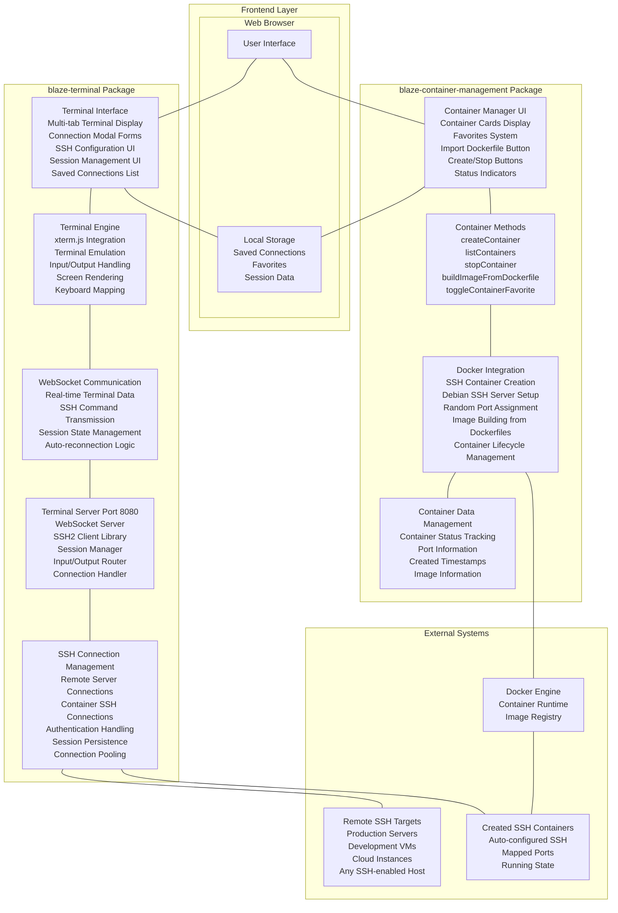

# Blaze Web Terminal

A powerful web-based terminal interface for Meteor.js applications that combines SSH connectivity with Docker container management. Built with Blaze templating, this application provides a VS Code-like terminal experience directly in your browser.


##  Features

### Terminal Capabilities
- **Multi-tab SSH terminals** - Connect to multiple servers simultaneously
- **Web-based xterm.js interface** - Full terminal emulation with 256-color support
- **Session persistence** - Terminals survive browser refreshes and reconnect automatically
- **Responsive design** - Works on desktop and mobile devices
- **VS Code-like interface** - Familiar terminal design and keyboard shortcuts

### Container Management
- **Docker integration** - Create, manage, and connect to Docker containers
- **SSH-enabled containers** - Automatic SSH server setup in containers
- **Favorites system** - Mark containers as favorites with persistent storage
- **Dockerfile import** - Build custom images from uploaded Dockerfiles
- **Real-time monitoring** - Live container status updates

### Connection Management
- **Saved connections** - Store frequently used SSH connections
- **Quick connect** - One-click connection to saved hosts
- **Connection validation** - Real-time connection status indicators
- **Automatic reconnection** - Seamless reconnection after network interruptions

##  Prerequisites

- **Node.js** 14+ and npm
- **Meteor.js** 3.3+
- **Docker** (for container management features)
- Modern web browser with WebSocket support

##  Installation

### 1. Clone and Setup

```bash
# Clone the repository
git clone <your-repo-url>
cd blaze-web-terminal

# Install dependencies
npm install

# Start the application
meteor run
```

### 2. Docker Setup (Optional)

For container management features:

```bash
# Ensure Docker is installed and running
docker --version

# Add your user to docker group (Linux)
sudo usermod -aG docker $USER
# Log out and back in for changes to take effect
```

### 3. Access the Application

Open your browser and navigate to:
```
http://localhost:3000
```

##  Quick Start

### Creating Your First Terminal

1. **Open Terminal Panel**
   - Click the terminal button in the bottom-right corner
   - Or use keyboard shortcut: `Ctrl/Cmd + \``

2. **Connect via SSH**
   - Click the "+" button to create a new connection
   - Choose the "SSH" tab
   - Enter your connection details:
     - Host: `your-server.com` or IP address
     - Port: `22` (default)
     - Username: Your SSH username
     - Password: Your SSH password
   - Click "Connect"

3. **Create a Container (Alternative)**
   - Click the "+" button
   - Choose the "Containers" tab
   - Click "Connect to Containers"
   - A new SSH-enabled container will be created automatically

### Managing Connections

- **Save Connections**: Click the "Save" button when creating an SSH connection
- **Favorite Containers**: Click the star icon on any container card
- **Import Dockerfiles**: Use the 📥 button to upload and build custom images

##  Architecture

### Client-Server Communication

```
Browser ←→ Meteor App ←→ WebSocket Server ←→ SSH/Docker
   ↑           ↑              ↑              ↑
Terminal    Blaze UI      Terminal Server   Remote Hosts
(xterm.js)               (Port 8080)       /Containers
```

### Package Structure

```
blaze-web-terminal/
├── client/
│   ├── main.html              # Main application template
│   ├── main.js                # Client-side entry point
│   └── main.css               # Global styles
├── packages/
│   ├── blaze-container-management/
│   │   ├── client/            # Container UI components
│   │   ├── server/            # Docker integration
│   │   └── README.md          # Container package docs
│   └── blaze-terminal/
│       ├── client/            # Terminal UI components
│       ├── server/            # WebSocket SSH server
│       └── README.md          # Terminal package docs
├── server/
├── package.json
└── README.md                  # This file
```

##  Configuration

### Environment Settings

Create a `settings.json` file for production:

```json
{
  "public": {
    "app": {
      "name": "Your Terminal App",
      "version": "1.0.0"
    }
  },
  "private": {
    "ssh": {
      "defaultHost": "localhost",
      "defaultPort": 22,
      "connectionTimeout": 10000
    },
    "security": {
      "sessionTimeout": 1800000,
      "maxSessionsPerUser": 5
    }
  }
}
```

Run with settings:
```bash
meteor run --settings settings.json
```

### Terminal Configuration

Default terminal settings can be modified in `packages/blaze-terminal/client/terminal.js`:

```javascript
const term = new Terminal({
  fontSize: 14,
  fontFamily: 'Monaco, Menlo, "Ubuntu Mono"',
  rows: 30,
  cols: 100,
  theme: {
    background: '#0c0c0c',
    foreground: '#cccccc'
  }
});
```

### Container Defaults

Modify the default Dockerfile in `packages/blaze-container-management/server/Dockerfile`:

```dockerfile
FROM debian:latest
RUN apt-get update && apt-get install -y openssh-server
# Change default password here
RUN echo 'root:your-secure-password' | chpasswd
```

##  Customization

### Themes

The terminal supports custom themes. Modify the theme object in the terminal configuration:

```javascript
theme: {
  background: '#1e1e1e',      // Dark theme
  foreground: '#d4d4d4',
  cursor: '#ffffff',
  black: '#000000',
  red: '#cd3131',
  green: '#0dbc79',
  yellow: '#e5e510',
  blue: '#2472c8',
  magenta: '#bc3fbc',
  cyan: '#11a8cd',
  white: '#e5e5e5'
}
```

### CSS Styling

Override default styles by adding CSS:

```css
/* Custom terminal appearance */
.terminal-panel {
  background: #your-color;
  border: 1px solid #your-border;
}

/* Custom container cards */
.container-card {
  background: linear-gradient(145deg, #color1, #color2);
}
```

##  API Reference

### Terminal Methods

```javascript
// Toggle terminal visibility
Template.terminal.toggleVisible();

// Create new SSH connection
Template.terminal.createSSHConnection({
  host: 'example.com',
  port: 22,
  username: 'user',
  password: 'pass'
});

// Focus active terminal
Template.terminal.focusActiveTerminal();
```

### Container Methods

```javascript
// Create new container
Meteor.call('createContainer', (error, result) => {
  if (result.success) {
    console.log('Container created:', result.containerId);
  }
});

// List all containers
Meteor.call('listContainers', (error, containers) => {
  console.log('Available containers:', containers);
});

// Stop container
Meteor.call('stopContainer', containerId);
```

##  Security Considerations

### SSH Connections
- **Passwords**: Not stored locally, only used for connection
- **Session Management**: Automatic timeout after inactivity
- **Network Security**: Use HTTPS in production for encrypted communication

### Container Security
- **Default Credentials**: Change default passwords in Dockerfiles
- **Port Exposure**: SSH ports are randomly assigned to avoid conflicts
- **Network Isolation**: Containers run in isolated Docker networks

### Best Practices
- Use SSH key authentication when possible
- Implement firewall rules for container ports
- Regular security updates for base images
- Monitor connection logs for suspicious activity

##  Troubleshooting

### Common Issues

**Terminal not accepting input:**
```javascript
// Debug focus issues
window.autoFocus();
window.fixTerminalFocus();
```

**WebSocket connection failed:**
- Ensure port 8080 is available
- Check firewall settings
- Verify Meteor server is running

**Docker integration issues:**
```bash
# Check Docker service
sudo systemctl status docker

# Test Docker permissions
docker ps

# Restart Docker if needed
sudo systemctl restart docker
```

**SSH connection timeout:**
- Verify host is reachable: `ping your-host.com`
- Check SSH service: `ssh user@host` from command line
- Ensure correct port and credentials

### Debug Mode

Enable debug logging:
```javascript
// In browser console
localStorage.setItem('terminal-debug', 'true');

// Check terminal instances
console.log(window.terminalInstances);
console.log(window.terminalSessions);
```

##  Deployment

### Production Deployment

1. **Build the application:**
```bash
meteor build ../output --architecture os.linux.x86_64
```

2. **Deploy using Docker:**
```dockerfile
FROM node:14-alpine
COPY bundle /app
WORKDIR /app/programs/server
RUN npm install
EXPOSE 3000 8080
CMD ["node", "main.js"]
```

3. **Environment Variables:**
```bash
export MONGO_URL=mongodb://localhost:27017/myapp
export ROOT_URL=https://yourdomain.com
export PORT=3000
```


##  Contributing

1. Fork the repository
2. Create a feature branch: `git checkout -b feature-name`
3. Make your changes and add tests
4. Commit: `git commit -m "Add feature-name"`
5. Push: `git push origin feature-name`
6. Create a Pull Request

### Development Setup

```bash
# Clone for development
git clone <repo-url>
cd blaze-web-terminal

# Install dependencies
npm install

# Start development server
meteor run

# Run tests
meteor test --driver-package meteortesting:mocha
```

##  Support

- **Documentation**: Check the `/packages/*/README.md` files for detailed package information
- **Issues**: Report bugs on the GitHub Issues page
- **Discussions**: Join community discussions for questions and feature requests

##  Roadmap

- [ ] SSH key authentication support
- [ ] File transfer capabilities
- [ ] Terminal session recording
- [ ] Multi-user collaboration
- [ ] Kubernetes integration
- [ ] Plugin system for extensions
- [ ] Mobile app companion

---

**Built with  using Meteor.js and modern web technologies**

For more detailed information about specific components, see:
- [Container Management Package](packages/blaze-container-management/README.md)
- [Terminal Package](packages/blaze-terminal/README.md)
